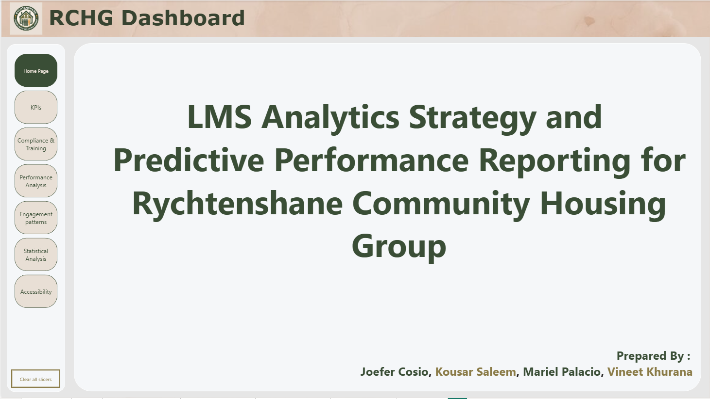
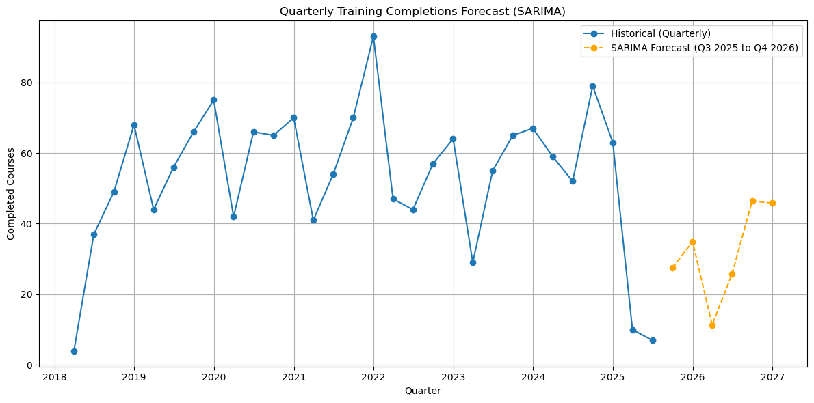
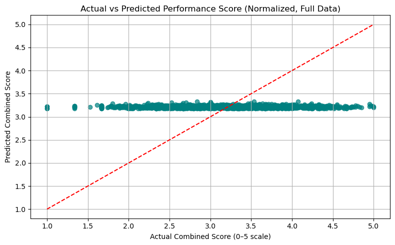
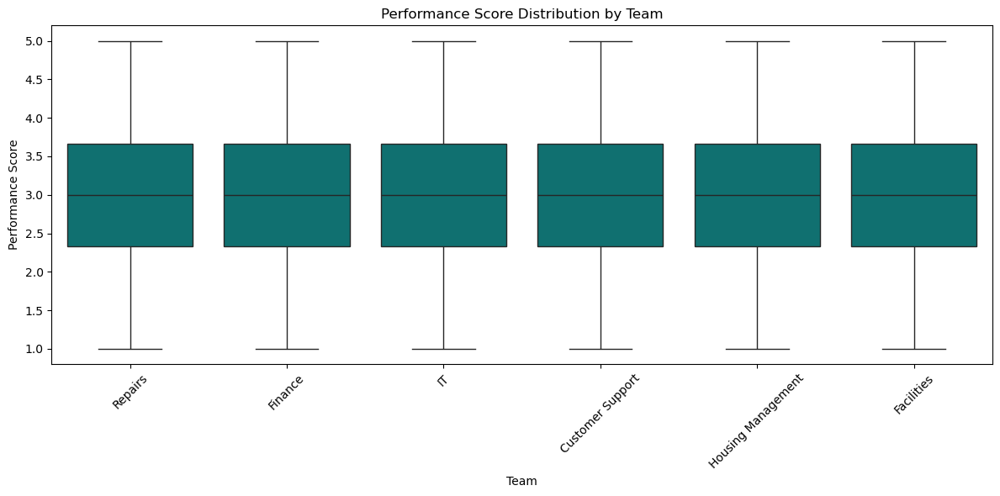
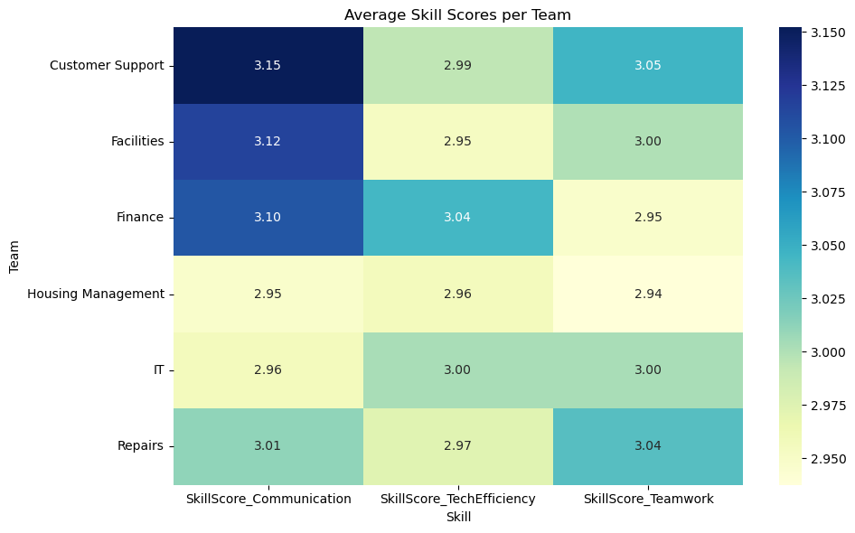

# 📊 RCHG LMS Analytics Strategy & Predictive Performance Reporting for Rychtenshane Community Housing Group 


## Project Summary

This project delivers a comprehensive analytics solution for **Rychtenshane Community Housing Group (RCHG)** to enhance their Learning Management System (LMS) strategy. As BI consultants, our team analyzed training data, built a data model, applied advanced statistical methods, and developed interactive dashboards in Power BI. The goal was to generate insights and predictive tools that support RCHG’s compliance tracking, learning engagement, and staff performance development.

Our solution enables RCHG to monitor course completion rates, detect engagement patterns, evaluate skill development across teams, and forecast future training outcomes using real historical data.

---


## 📁 Dashboard Page Descriptions

### 1. **Compliance & Training Summary**
- *KPI Cards:* 
  > Total Courses Taken, Completed Courses, Mandatory Courses Completed, Overdue Courses, Average Days to Complete, Average Duration (Mins)
- *Visuals*
  - Quarter-on-Quarter Trend Chart: Detect seasonal or quarterly shifts in training volume and adherence to deadlines.
  - Training by Department :  Identify departments with high or low completion efficiency.
  - Training Completion by Location
  - Top 5 & Bottom 5 Roles by Course Completion: Detect roles that are high-performing in training engagement or at risk.
- *Slicers / Filters* : Department, Location, Mandatory vs. Regular Courses, Date Range

Refer to: [`Compliance & Training Summary`](Images/Dashboard/Compliance&TrainingSummary.png)

### 2. **Performance Analysis**
- *KPI Cards:* 
    >Total Roles, Total Teams, Total Courses, Total Skill Gaps, Average Skill Score (Communication, Teamwork, Tech Efficiency), Employee With the Highest Skill Gap.
- *Visuals*
  - Skill Gap Insights: Visuals highlight where skill development is lagging across roles, courses, teams, categories, and locations - helping identify underperforming areas and prioritize targeted upskilling.
- *Slicers / Filters* : Department, Location, Mandatory vs. Regular Courses, Date Range

Refer to: [`Performance Analysis`](Images/Dashboard/PerformanceAnalysis.png)

### 3. **Engagement Patterns**
- *KPI Cards:* 
  > Total Device Types(e.g., Desktop, Mobile, Tablet), Total Time Spent (Hours), Average Engagement Days, Max Engagement Days, Average Time Spent (Minutes), Employee With Most Completed Courses

- *Visuals*
  - Time Spent (Hours) by Role: Training effort per job role.
  - Device Usage Breakdown
  - Time Spent (Hours) by Location: Compare training time geographically.
  - Enrollment vs. Last Access (Days): Analyzed how long users take to revisit courses, with mean and median lines for comparison.
- *Slicers / Filters* : Department, Location, Mandatory vs. Regular Courses, Date Range

Refer to: [`Engagement Patterns`](Images/Dashboard/EngagementPatterns.png)

### 4. **Statistical Insights**
- *KPI Cards:* Retained, this provide continuity while interpreting deeper analytical results.

- *Visuals*
    - Accessibility Usage Breakdown: Bar chart comparing skill scores and feedback ratings for screen reader users vs. non-users.
    - Total Courses Taken (Screen Reader vs. Non-Screen Reader)
    - Feedback Rating Comparison : Bar chart illustrating differences in qualitative feedback categories (Needs Improvement, Too Basic, Great Course, Very Useful, Excellent Content) segmented by screen reader usage.
    - Top Courses by Screen Reader Usage: Courses most frequently accessed with a screen reader.
    - Employee Participation & Score Comparison: Comparative bar chart showing distinct employees using screen readers vs. not, along with their average performance scores.]


Refer to: [`Statistical Insights`](Images/Dashboard/StatisticalInsights.png)

### 5. **Accessibility Overview**
- *KPI Cards:* Retained, this provide continuity while interpreting deeper analytical results.

- *Advanced Analytics Visuals*
  - Forecasting: Predict Training Completions (SARIMA): Time series chart showing predicted training completions for the next 12 months or 4 quarters. Helps anticipate future compliance workloads and training resource needs.
  - Regression Analysis: Training Time & Frequency vs. Score, Scatterplot with regression line modeling the relationship between `Total training time,Number of trainings, Performance scores` Aimed at understanding how effort translates into results.
  - ANOVA Results: Skill Scores Across Teams: Compare training time geographically. Boxplot of skill score distributions per team Heatmap showing scores per team. Confirming that no statistically significant differences were found between teams. Therefore, we do not reject the null hypothesis.e

Refer to: [`Accessibility Overview`](Images/Dashboard/AccessibilityOverview.png)

---
## 📐 DAX Columns and Measures

```DAX
Quarter = Datedim[Year] & "Q" & QUARTER(Datedim[Date])

DateTable = 
ADDCOLUMNS (
    CALENDAR (DATE(2018,1,1), DATE(2025,12,30)),
    "Year", YEAR([Date]),
    "Quarter", "Q" & FORMAT([Date], "Q"),
    "YearQuarter", FORMAT([Date], "YYYY") & " Q" & FORMAT([Date], "Q"),
    "QuarterStart", DATE(YEAR([Date]), SWITCH(QUARTER([Date]), 1,1, 2,4, 3,7, 4,12), 1),
    "YearMonth", FORMAT([Date], "YYYY-MM"),
    "MonthStart", DATE(YEAR([Date]), MONTH([Date]), 1)
)

EmployeeFullName = Employee[LastName] & "," & Employee[FirstName]

Accessibility = IF(LMSFact[UsedScreenReader] = 1 , "Screen Reader", "Non-ScreenReader")

daystocompletecourse = LMSFact[CompletionDate] - LMSFact[EnrollmentDate]

EngagementDays = LMSFact[LastAccessDate] - LMSFact[EnrollmentDate]

MandatoryCourse = IF(LMSFact[MandatoryID] = "0", "Regular Course", "Mandatory Course")

SUM(Score)
SUM(SkillGapFlag)
SUM(SkillScore_Communication)
SUM(SkillScore_Teamwork)
SUM(SkillScore_TechEfficiency)
SUM(UsedScreenReader)

SkillScore_x = 
    (LMSFact[SkillScore_Communication] + 
     LMSFact[SkillScore_Teamwork] + 
     LMSFact[SkillScore_TechEfficiency]) / 3
```
---

## 📊Statistical Insights:

## Summary of Statistical Techniques Used
| Technique         | Library        | Purpose                                                             |
| ----------------- | -------------- | ------------------------------------------------------------------- |
| Seasonal ARIMA (SARIMA)         | `pmdarima`    | Forecast monthly training completions for the next 4 quarters       |
| Linear Regression | `scikit-learn` | Analyze how training frequency and duration influence `Score`       |
| ANOVA (F-test)    | `scipy.stats`  | Test if mean skill scores differ significantly across `Team` groups |
| Boxplots/Heatmap   | `seaborn`      | Visual validation of score distributions per team before ANOVA      |


### 📈Forecasting:

#### Predict training completions for next quarter
In this analysis, we modeled and forecasted the number of quarterly training completions using time series techniques. The goal was to understand historical trends and predict future completions to support planning and capacity-building efforts.
- Model Used: Seasonal ARIMA (SARIMA)
- Forecasted Quarter: Q3 2025 (2025-09-30)
- Predicted Completed Courses: 27.46



---

#### SARIMA Forecast for the Next 6 Quarters (Q3 2025 to Q4 2026)

The SARIMA model projects training completions for six future quarters as follows:

| Quarter       | Forecasted Completions |
|---------------|------------------------|
| 2025-09-30    | 27.46                  |
| 2025-12-31    | 34.97                  |
| 2026-03-31    | 11.35                  |
| 2026-06-30    | 25.79                  |
| 2026-09-30    | 46.44                  |
| 2026-12-31    | 45.83                  |

Refer to `Quarterly Training Completions Forecast (SARIMA)`

---

#### Actual vs SARIMA Forecast (2023–2025)

Comparison of actual training completions versus SARIMA predictions:

| Quarter       | Actual | Predicted |
|---------------|--------|-----------|
| 2023-03-31    | 29     | 29.2      |
| 2023-06-30    | 55     | 42.8      |
| 2023-09-30    | 65     | 52.6      |
| 2023-12-31    | 67     | 64.3      |
| 2024-03-31    | 59     | 29.5      |
| 2024-06-30    | 52     | 43.1      |
| 2024-09-30    | 79     | 52.8      |
| 2024-12-31    | 63     | 64.5      |
| 2025-03-31    | 10     | 29.7      |
| 2025-06-30    | 7      | 43.3      |

Refer to: [`Quarterly Training Completions: Actual vs SARIMA Forecast (2023–2025)`](Images/Statistical_Insights/Quarterly_Training_Completions_Actual_vs_SARIMA_Forecast.png)

---

#### 🔍 Interpretation & Key Takeaways

- The SARIMA model was trained to forecast future training completions based on historical quarterly trends.
- It captured seasonal fluctuations effectively during 2023 and 2024, offering moderate prediction accuracy.
- In 2025, we observed unexpected surges in actual training completions, exceeding model predictions likely driven by new organizational policies or increased training mandates.
- Next Quarter Forecast: The SARIMA model predicts 27.46 completions for the upcoming quarter ending 2025-09-30.

### ⏳ Regression Analysis: Impact of Training Time and Frequency on Performance Scores


To evaluate the relationship between training engagement and employee performance, we performed a linear regression using:

- **DurationMinutes**: Total time (in minutes) an employee spent on completed trainings.
- **CourseFrequency**: Number of completed training courses per employee.

The **target variable** was the **Combined Performance Score**, calculated as the average of:
- Communication Skill Score
- Technical Efficiency Score
- Teamwork Score
- Normalized Course Score (scaled to a 0–5 range)

#### Regression Results

| Term                  | Coefficient |
|-----------------------|-------------|
| Intercept             | 3.14        |
| DurationMinutes       | 0.0005      |
| CourseFrequency       | 0.0147      |

#### Interpretation

- The **positive coefficient** for `DurationMinutes` is 0.0005, meaning that for every additional minute spent in training, the combined performance score increases by 0.0005 points suggests that longer training durations are slightly associated with better performance outcomes.
- The **positive coefficient** for `CourseFrequency` is 0.0147, indicating that each additional course completed is associated with an increase of 0.0147 points indicates that employees completing more courses tend to score higher on performance metrics.
- Though the coefficients are small, the direction of influence is meaningful and can inform targeted training interventions.


#### Model Visualization

The following scatter plot compares actual vs predicted performance scores:




### 🧑‍💻 ANOVA Analysis: Compare mean skill scores across multiple departments to identify statistically significant performance disparities

We conducted ANOVA tests to assess whether the mean performance scores differ significantly across teams.

### ANOVA Results Summary

| Skill                      | F-statistic | P-value | Result                                 |
|---------------------------|-------------|---------|----------------------------------------|
| Communication             | 1.31        | 0.2554  | No significant difference              |
| Technical Efficiency      | 0.18        | 0.9688  | No significant difference              |
| Teamwork                  | 0.33        | 0.8974  | No significant difference              |
| **Overall Performance**   | 0.79        | 0.5560  | No significant difference across teams |

> **Conclusion**: No statistically significant differences were found between teams in any of the skill categories.

### Performance Score Distribution by Team



### Average Skill Scores per Team



---
✅ These methods support RCHG’s goals of:

- Anticipating training needs (forecasting)

- Understanding training-performance relationships (regression)

- Identifying disparities in team skill development (ANOVA)


🎯 How Our Solution Meets RCHG's Goals

✅ Compliance Insight
→ Visual tracking of mandatory course completions and overdue patterns.

✅ Learning Engagement
→ Device usage and training duration insights per role and location.

✅ Skill Development Evaluation
→ Skill score distribution across teams with statistical validation.

✅ Predictive Readiness
→ 12-month forecast of training completions to inform planning.

✅ Actionable Recommendations
→ Strategic suggestions included in the PDF report to close skill gaps and boost LMS engagement.

---
## 👥 Team Members & GitHub Handles
- Joefer Cosio . – Project Organizer, Power BI Reporting, Github Submission 
GitHub: [@ZO4-v0](https://github.com/ZO4-v0)

- Kousar Saleem – Statistical Analysis, Documentation, data cleaning, Report Writing 
GitHub: [@Kousarsaleem32](https://github.com/Kousarsaleem32)

- Vineet Khurana  – Data Modelling, Report Creation 
GitHub: [@vibvinit](https://github.com/vibvinit)

- Mariel Palacio – Statistical Analysis, Documentation
GitHub: [@MaruPalacio](https://github.com/MaruPalacio)

## 📂 Files in this Repo

```
RCHG_LMS_BI_Consulting_Project
├── Data
│   └── LMS_Cleaned_dataset_Vineet.xlsx
│
├── Images
│   ├── Dashboard
│   │   ├── AccessibilityOverview.png
│   │   ├── Compliance&TrainingSummary.png
│   │   ├── DashboardHomePage.png
│   │   ├── EngagementPatterns.png
│   │   ├── PerformanceAnalysis.png
│   │   └── StatisticalInsights.png
│   │
│   └── Statistical_Insights
│       ├── Actual_vs_Predicted_Performance.png
│       ├── Boxplot_of_Performance_Scores.png
│       ├── Heatmap_of_Skill_Scores.png
│       ├── QuarterlyTraining.png
│       └── Quarterly_Training_Completion.png
│
├── raw data
│   └── RCHG_LMS_Analytics_Dataset.xlsx
│
└── README.md
```
