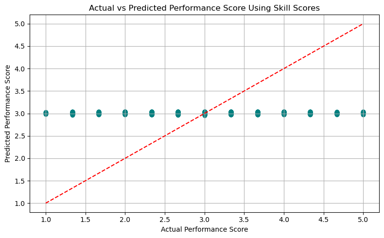
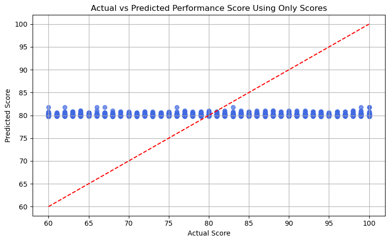

# 📊 RCHG LMS Analytics Strategy & Predictive Performance Reporting for Rychtenshane Community Housing Group 


## Project Summary

This project delivers a comprehensive analytics solution for **Rychtenshane Community Housing Group (RCHG)** to enhance their Learning Management System (LMS) strategy. As BI consultants, our team analyzed training data, built a data model, applied advanced statistical methods, and developed interactive dashboards in Power BI. The goal was to generate insights and predictive tools that support RCHG’s compliance tracking, learning engagement, and staff performance development.

Our solution enables RCHG to monitor course completion rates, detect engagement patterns, evaluate skill development across teams, and forecast future training outcomes using real historical data.

## Key Insights and Recommendations
📌Trends & Performance Highlights
  - **Training Engagement**: 2,000 courses taken with 80% completion; IT and Facilities lead (>82%), suggesting strong compliance habits.
  - **Quarterly Patterns**: Training completions increased steadily until 2024 (peak: Q1 2024), then sharply declined in 2025, signaling a disruption.
  - **Role-Based Gaps**: Network Technicians and Cleaners show high engagement (~85%); Payroll and Maintenance roles lag (~78–80%).
  - **Skill Distribution**: Most roles average SkillScores near 3.0. Top: Maintenance Technicians (3.13); Bottom: Electricians (2.90).
  - **Course Ratings**: “Health & Safety” (3.30) and “Customer Service” perform best; “Safeguarding Adults” (2.80) underperforms.
  - **Skill Gaps**: Concentrated in IT and Compliance categories (309+ gaps), indicating need for improved retention/application.
  - **Device & Time Use**: Balanced access across desktop/tablet/mobile (~33% each); average course time is 75 mins over 77 days.
  - **Accessibility Inclusion**: 21% of learners use screen readers — these users score higher (81.08 vs. 79.88), proving strong LMS accessibility.
  - **Forecasting Insight**: Completion trends show seasonality; forecasting expects mild recovery in 2026–2027.

⚠️ Key Risks Identified
  - **2025 Drop-off**: Completion fell to just 12 in Q1 2025 — potential policy or operational disruption.
  - **20% Overdue Backlog**: Uncompleted mandatory courses may risk compliance and learner motivation.
  - **Completion Delays**: Avg. 32 days to complete courses may reflect scheduling conflicts or low prioritization.
  - **Field Role Disengagement**: Roles like Finance Analyst and Payroll Specialist show weak engagement and lower scores.
  - **Course Underperformance**: Key compliance-related courses like “Data Protection” show poor outcomes despite importance.
  - **System Inactivity Lag**: Long gaps between enrollment and last access suggest courses stay open beyond intended periods.

🌱 Opportunities for Improvement
  - **Early Warning System**: Monitor overdue trends and quarterly dips to trigger timely interventions.
  - **Targeted Coaching**: Custom learning for low-performing roles (e.g., workshops, supervisor nudges, blended training).
  - **Faster Completion Campaigns**: Set mini-deadlines and reward early completions to reduce 32-day average.
  - **Replicate High Performers**: Analyze successful practices in IT & Facilities to scale across departments.
  - **Refine Low-Performing Content**: Revise poorly rated courses with modern, scenario-based or gamified content.
  - **Mobile Optimization**: Leverage the 32% mobile usage by designing mobile-first content for greater accessibility.
  - **Site-Based Strategy**: Civic Centre Hub shows the highest average score (3.06); model its practices across other locations.
  - **Dashboard Adoption**: Real-time monitoring through Power BI supports proactive, data-driven HR planning.
  - **Course Optimization Using Forecast and Regression Models**: Use forecasting outputs to plan course delivery around seasonal dips and adjust curriculum based on regression insights—refining course pacing, duration, or interactivity to enhance outcomes.

---


---
## 📑 Table of Contents

- [Key Insights and Recommendations](#key-insights-and-recommendations)
- [Dashboard Page Descriptions](#-dashboard-page-descriptions)
- [DAX Columns and Measures](#-dax-columns-and-measures)
- [Statistical Insights](#statistical-insights)
- [Team Members and GitHub Handles](#team-members-and-github-handles)
- [Files in this Repo](#files-in-this-repo)

---

## 📁 Dashboard Page Descriptions

### 1. **Compliance & Training Summary**
- *KPI Cards:* 
  > Total Courses Taken, Completed Courses, Mandatory Courses Completed, Overdue Courses, Average Days to Complete, Average Duration (Mins)
- *Visuals*
  - Quarter-on-Quarter Trend Chart: Detect seasonal or quarterly shifts in training volume and adherence to deadlines.
  - Training by Department :  Identify departments with high or low completion efficiency.
  - Training Completion by Location
  - Top 5 & Bottom 5 Roles by Course Completion: Detect roles that are high-performing in training engagement or at risk.
- *Slicers / Filters* : Department, Location, Mandatory vs. Regular Courses, Date Range

Refer to: [`Compliance & Training Summary`](Images/Dashboard/Compliance&TrainingSummary.png)

### 2. **Performance Analysis**
- *KPI Cards:* 
    >Total Roles, Total Teams, Total Courses, Total Skill Gaps, Average Skill Score (Communication, Teamwork, Tech Efficiency), Employee With the Highest Skill Gap.
- *Visuals*
  - Skill Gap Insights: Visuals highlight where skill development is lagging across roles, courses, teams, categories, and locations - helping identify underperforming areas and prioritize targeted upskilling.
- *Slicers / Filters* : Department, Location, Mandatory vs. Regular Courses, Date Range

Refer to: [`Performance Analysis`](Images/Dashboard/PerformanceAnalysis.png)

### 3. **Engagement Patterns**
- *KPI Cards:* 
  > Total Device Types(e.g., Desktop, Mobile, Tablet), Total Time Spent (Hours), Average Engagement Days, Max Engagement Days, Average Time Spent (Minutes), Employee With Most Completed Courses

- *Visuals*
  - Time Spent (Hours) by Role: Training effort per job role.
  - Device Usage Breakdown
  - Time Spent (Hours) by Location: Compare training time geographically.
  - Enrollment vs. Last Access (Days): Analyzed how long users take to revisit courses, with mean and median lines for comparison.
- *Slicers / Filters* : Department, Location, Mandatory vs. Regular Courses, Date Range

Refer to: [`Engagement Patterns`](Images/Dashboard/EngagementPatterns.png)

### 4. **Statistical Insights**
- *KPI Cards:* Retained, this provide continuity while interpreting deeper analytical results.

- *Visuals*
    - Accessibility Usage Breakdown: Bar chart comparing skill scores and feedback ratings for screen reader users vs. non-users.
    - Total Courses Taken (Screen Reader vs. Non-Screen Reader)
    - Feedback Rating Comparison : Bar chart illustrating differences in qualitative feedback categories (Needs Improvement, Too Basic, Great Course, Very Useful, Excellent Content) segmented by screen reader usage.
    - Top Courses by Screen Reader Usage: Courses most frequently accessed with a screen reader.
    - Employee Participation & Score Comparison: Comparative bar chart showing distinct employees using screen readers vs. not, along with their average performance scores.]


Refer to: [`Statistical Insights`](Images/Dashboard/StatisticalInsights.png)

### 5. **Accessibility Overview**
- *KPI Cards:* Retained, this provide continuity while interpreting deeper analytical results.

- *Advanced Analytics Visuals*
  - Forecasting: Predict Training Completions (SARIMA): Time series chart showing predicted training completions for the next 12 months or 4 quarters. Helps anticipate future compliance workloads and training resource needs.
  - Regression Analysis: Training Time & Frequency vs. Score, Scatterplot with regression line modeling the relationship between `Total training time,Number of trainings, Performance scores` Aimed at understanding how effort translates into results.
  - ANOVA Results: Skill Scores Across Teams: Compare training time geographically. Boxplot of skill score distributions per team Heatmap showing scores per team. Confirming that no statistically significant differences were found between teams. Therefore, we do not reject the null hypothesis.e

Refer to: [`Accessibility Overview`](Images/Dashboard/AccessibilityOverview.png)

---
## 📐 DAX Columns and Measures

```DAX
Quarter = Datedim[Year] & "Q" & QUARTER(Datedim[Date])

DateTable = 
ADDCOLUMNS (
    CALENDAR (DATE(2018,1,1), DATE(2025,12,30)),
    "Year", YEAR([Date]),
    "Quarter", "Q" & FORMAT([Date], "Q"),
    "YearQuarter", FORMAT([Date], "YYYY") & " Q" & FORMAT([Date], "Q"),
    "QuarterStart", DATE(YEAR([Date]), SWITCH(QUARTER([Date]), 1,1, 2,4, 3,7, 4,12), 1),
    "YearMonth", FORMAT([Date], "YYYY-MM"),
    "MonthStart", DATE(YEAR([Date]), MONTH([Date]), 1)
)

EmployeeFullName = Employee[LastName] & "," & Employee[FirstName]

Accessibility = IF(LMSFact[UsedScreenReader] = 1 , "Screen Reader", "Non-ScreenReader")

daystocompletecourse = LMSFact[CompletionDate] - LMSFact[EnrollmentDate]

EngagementDays = LMSFact[LastAccessDate] - LMSFact[EnrollmentDate]

MandatoryCourse = IF(LMSFact[MandatoryID] = "0", "Regular Course", "Mandatory Course")

SUM(Score)
SUM(SkillGapFlag)
SUM(SkillScore_Communication)
SUM(SkillScore_Teamwork)
SUM(SkillScore_TechEfficiency)
SUM(UsedScreenReader)

SkillScore_x = 
    (LMSFact[SkillScore_Communication] + 
     LMSFact[SkillScore_Teamwork] + 
     LMSFact[SkillScore_TechEfficiency]) / 3
Measures 
%CourseCompletion = [CourseCompleted]/[Totalcoursecount]
%Mandatorycoursecompletion = [Mandatorycoursecompleted]/[Mandatorycoursecount]
%totaloverdue = [CourseOverdue]/[Totalcoursecount]
AverageDuration = AVERAGE(LMSFact[DurationMinutes])
AverageFeedback = AVERAGE(Feedback[FeedbackRating])
Averagescore = AVERAGE(LMSFact[Score])
AverageSkillscore = (AVERAGE(LMSFact[SkillScore_Communication])+AVERAGE(LMSFact[SkillScore_Teamwork])+AVERAGE(LMSFact[SkillScore_TechEfficiency])/3)
CourseCompleted = CALCULATE(COUNT(LMSFact[CourseID]), LMSFact[CompletionStatus]=1)
CourseOverdue = [Totalcoursecount] - [CourseCompleted]
Mandatorycoursecompleted = CALCULATE([Mandatorycoursecount],LMSFact[CompletionStatus]=1)
Mandatorycoursecount = CALCULATE(COUNT(LMSFact[CourseID]),Mandatory[MandatoryID]=1)
Review frequency = DISTINCTCOUNT(Course[CourseID])
Skillgapcount = CALCULATE(COUNT(LMSFact[SkillGapFlag]),LMSFact[SkillGapFlag]=1)
Time Spent (in hrs) = DIVIDE(SUM(LMSFact[DurationMinutes]),60)
Totalcoursecount = CALCULATE(COUNT(LMSFact[CourseID]))
TotalSkillscore = SUM(LMSFact[SkillScore_Communication])+SUM(LMSFact[SkillScore_Teamwork])+SUM(LMSFact[SkillScore_TechEfficiency])
Rank Value (category) = 
      VAR _rank_top =
          RANKX ( ( ALLSELECTED ( Role[RoleID] ) ), [%CourseCompletion],, DESC, DENSE )
      VAR _rank_bottom =
          RANKX ( ( ALLSELECTED ( Role[RoleID] ) ), [%CourseCompletion],, ASC, DENSE )
      VAR _result =
          IF (
              _rank_top <= 5,
              [%CourseCompletion],
              IF ( _rank_bottom <= 5, [%CourseCompletion], BLANK () )
          )
      RETURN
          _result

Top Employee By Course Count = 
VAR FlagCounts =
        SUMMARIZE (
            Employee,
            Employee[EmployeeFullName],
            "FlagCount", CALCULATE ( COUNTROWS ( FILTER ( LMSFact, LMSFact[CompletionStatus] = 1 ) ) )
        )
    VAR MaxFlagCount =
        MAXX ( FlagCounts, [FlagCount] )
    VAR TopEmployee =
        CALCULATETABLE (
            FILTER ( FlagCounts, [FlagCount] = MaxFlagCount ),
            TOPN ( 1, FlagCounts, [FlagCount], DESC )
        )
    RETURN
        SELECTCOLUMNS ( TopEmployee, "TopEmployee", Employee[EmployeeFullName] )

```
---

## 📊Statistical Insights

### Summary of Statistical Techniques Used
| Technique         | Library        | Purpose                                                             |
| ----------------- | -------------- | ------------------------------------------------------------------- |
| Seasonal ARIMA (SARIMA)         | `pmdarima`    | Forecast monthly training completions for the next 4 quarters       |
| Linear Regression | `scikit-learn` | Analyze how training frequency and duration influence `Score`       |
| ANOVA (F-test)    | `scipy.stats`  | Test if mean skill scores differ significantly across `Team` groups |
| Boxplots/Heatmap   | `seaborn`      | Visual validation of score distributions per team before ANOVA      |


### 📈Forecasting:

#### Predict training completions for next quarter
In this analysis, we modeled and forecasted the number of quarterly training completions using time series techniques. The goal was to understand historical trends and predict future completions to support planning and capacity-building efforts.
- Model Used: Seasonal ARIMA (SARIMA)
- Forecasted Quarter: Q3 2025 (2025-09-30)
- Predicted Completed Courses: 27.46


---

#### SARIMA Forecast for the Next 6 Quarters (Q3 2025 to Q4 2026)

The SARIMA model projects training completions for six future quarters as follows:

| Quarter       | Forecasted Completions |
|---------------|------------------------|
| 2025-09-30    | 27.46                  |
| 2025-12-31    | 34.97                  |
| 2026-03-31    | 11.35                  |
| 2026-06-30    | 25.79                  |
| 2026-09-30    | 46.44                  |
| 2026-12-31    | 45.83                  |

Refer to `Quarterly Training Completions Forecast (SARIMA)`

---

#### Actual vs SARIMA Forecast (2023–2025)

Comparison of actual training completions versus SARIMA predictions:

| Quarter       | Actual | Predicted |
|---------------|--------|-----------|
| 2023-03-31    | 29     | 29.2      |
| 2023-06-30    | 55     | 42.8      |
| 2023-09-30    | 65     | 52.6      |
| 2023-12-31    | 67     | 64.3      |
| 2024-03-31    | 59     | 29.5      |
| 2024-06-30    | 52     | 43.1      |
| 2024-09-30    | 79     | 52.8      |
| 2024-12-31    | 63     | 64.5      |
| 2025-03-31    | 10     | 29.7      |
| 2025-06-30    | 7      | 43.3      |

Refer to: [`Quarterly Training Completions: Actual vs SARIMA Forecast (2023–2025)`](Images/Statistical_Insights/Quarterly_Training_Completions_Actual_vs_SARIMA_Forecast.png)

---

#### 🔍 Interpretation & Key Takeaways

- The SARIMA model was trained to forecast future training completions based on historical quarterly trends.
- It captured seasonal fluctuations effectively during 2023 and 2024, offering moderate prediction accuracy.
- In 2025, we observed unexpected surges in actual training completions, exceeding model predictions likely driven by new organizational policies or increased training mandates.
- Next Quarter Forecast: The SARIMA model predicts 27.46 completions for the upcoming quarter ending 2025-09-30.

### ⏳ Regression Analysis: Impact of Training Time and Frequency on Performance Scores

This analysis investigates how two key training variables training duration and course frequency influence employee performance. We applied linear regression using two approaches:

1. **Raw Performance Score** (out of 100)  
2. **Combined Skill Score** (average of Communication, Technical Efficiency, and Teamwork; scaled 0–5)

The input features used in both models were:
- **DurationMinutes**: Total time (in minutes) an employee spent on completed trainings  
- **CourseFrequency**: Total number of completed training courses by an employee  

---

#### Regression Using Raw Performance Score (0–100 Scale)

| Term              | Coefficient |
|-------------------|-------------|
| Intercept         | 79.55       |
| DurationMinutes   | -0.0001     |
| CourseFrequency   | 0.2553      |

---

#### Regression Using Combined Skill Score (0–5 Scale)

| Term              | Coefficient |
|-------------------|-------------|
| Intercept         | 2.97        |
| DurationMinutes   | 0.0007      |
| CourseFrequency   | -0.0041     |

---

#### Interpretation

**DurationMinutes**:
- In the **skill-based model**, training time had a **positive** coefficient (0.0007), indicating a minor improvement in skill scores with additional time.
- In contrast, the **raw score model** produced a **negative** coefficient (-0.0001), suggesting that longer durations might not translate into better performance possibly due to distractions, content complexity, or inefficiencies.
  
**CourseFrequency**:
- In the **raw score model**, the effect was **strongly positive** (0.2553), showing that employees completing more courses tend to score significantly higher.
- The **skill-based model**, however, revealed a **slightly negative** effect (-0.0041), suggesting potential diminishing returns in skill acquisition for high volume learners.

> **Insight**:  
> While course repetition boosts raw scores, improvement in real-world skills may require deeper or more contextual learning approaches. Also, longer training time alone doesn't guarantee performance gains it could signal confusion, multitasking, or lack of engagement.

---

#### Model Visualization

The following scatter plot compares actual vs predicted performance scores:





### 🧑‍💻 ANOVA Analysis: Compare mean skill scores across multiple departments to identify statistically significant performance disparities

We conducted ANOVA tests to assess whether the mean performance scores differ significantly across teams.

#### ANOVA Results Summary

| Skill                      | F-statistic | P-value | Result                                 |
|---------------------------|-------------|---------|----------------------------------------|
| Communication             | 1.31        | 0.2554  | No significant difference              |
| Technical Efficiency      | 0.18        | 0.9688  | No significant difference              |
| Teamwork                  | 0.33        | 0.8974  | No significant difference              |
| **Overall Performance**   | 0.79        | 0.5560  | No significant difference across teams |

> **Conclusion**: No statistically significant differences were found between teams in any of the skill categories.

#### Performance Score Distribution by Team


#### Average Skill Scores per Team


---
✅ These methods support RCHG’s goals of:

- Anticipating training needs (forecasting)

- Understanding training-performance relationships (regression)

- Identifying disparities in team skill development (ANOVA)

---
## 👥Team Members and GitHub Handles
- Joefer Cosio . – Project Organizer, Power BI Reporting, Github Submission 

GitHub: [@ZO4-v0](https://github.com/ZO4-v0)

- Kousar Saleem – Statistical Analysis, Documentation, data cleaning, Report Writing 

GitHub: [@Kousarsaleem32](https://github.com/Kousarsaleem32)

- Vineet Khurana  – Data Modelling, Report Creation 

GitHub: [@vibvinit](https://github.com/vibvinit)

- Mariel Palacio – Statistical Analysis, Documentation

GitHub: [@MaruPalacio](https://github.com/MaruPalacio)

## 📂Files in this Repo

```
RCHG_LMS_BI_Consulting_Project
│
├── Images
│   ├── Dashboard
│   │   ├── AccessibilityOverview.png
│   │   ├── Compliance&TrainingSummary.png
│   │   ├── DashboardHomePage.png
│   │   ├── EngagementPatterns.png
│   │   ├── PerformanceAnalysis.png
│   │   └── StatisticalInsights.png
│   │
│   ├── Icons
│   │   ├── alert.png
│   │   ├── back-in-time.png
│   │   ├── calendar.png
│   │   ├── checklist.png
│   │   ├── clock.png
│   │   ├── danger.png
│   │   ├── done.png
│   │   ├── management.png
│   │   ├── online-learning.png
│   │   ├── overdue.png
│   │   ├── responsive.png
│   │   ├── score.png
│   │   ├── skill.png
│   │   └── united.png
│   │
│   └── Statistical_Insights
│       ├── Actual_vs_Predicted_Performance_Score.png
│       ├── Actual_vs_Predicted_Performance_Score_Using_Only_Scores.png
│       ├── Actual_vs_Predicted_Performance_Score_Using_Skill_Scores.png
│       ├── Boxplot_of_Performance_Scores.png
│       ├── Heatmap_of_Skill_Scores.png
│       ├── QuarterlyTraining.png
│       └── Quarterly_Training_Completions_Actual_vs_SARIMA_Forecast.png
│
├── raw data
│   ├── RCHG_LMS_Analytics_Dataset.xlsx
|   └── RCHG_LMS_Dataset_powerBI_Report.xlsx
│
├── RDAMP_LMS_Analytics_RCHG_Powerbi.pbix
|
├── RDAMP_LMS_Analytics_RCHG_Presentation.pptx
|
├──RDAMP_LMS_Analytics_RCHG_Report.docx
│
├──RDAMP_LMS_Analytics_RCHG_Stats.ipynb
|
├──RDAMP_LMS_Analytics_RCHG_Tracking.xlsx
|
├──RDAMP_LMS_Analytics_RCHG_Report.pdf
│
└── README.md
```
